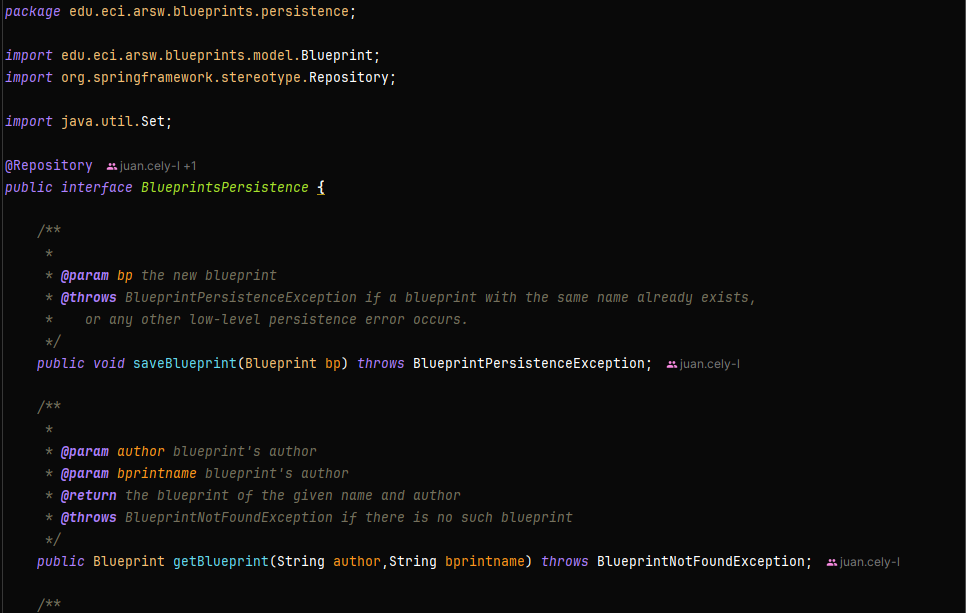
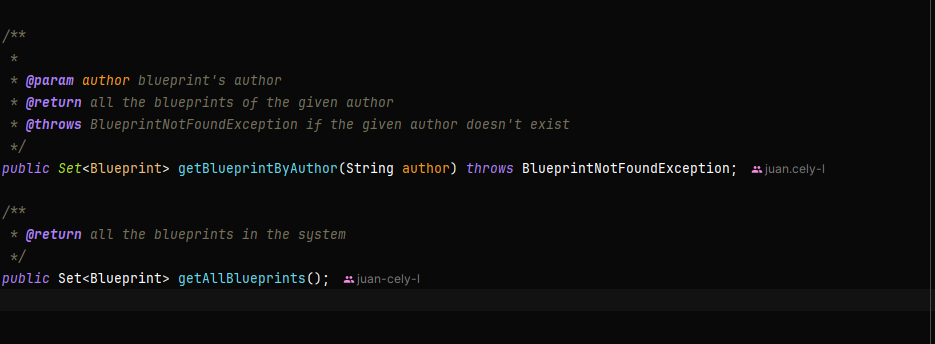
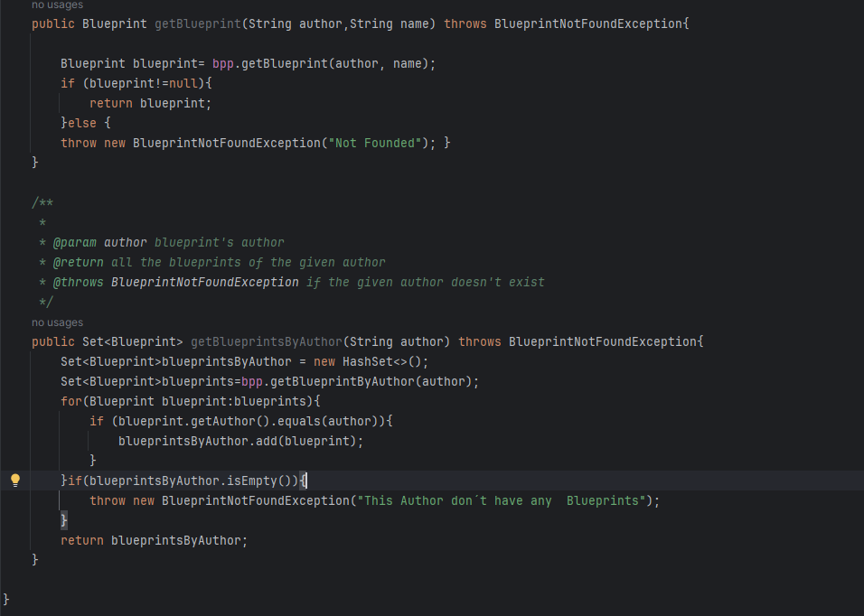
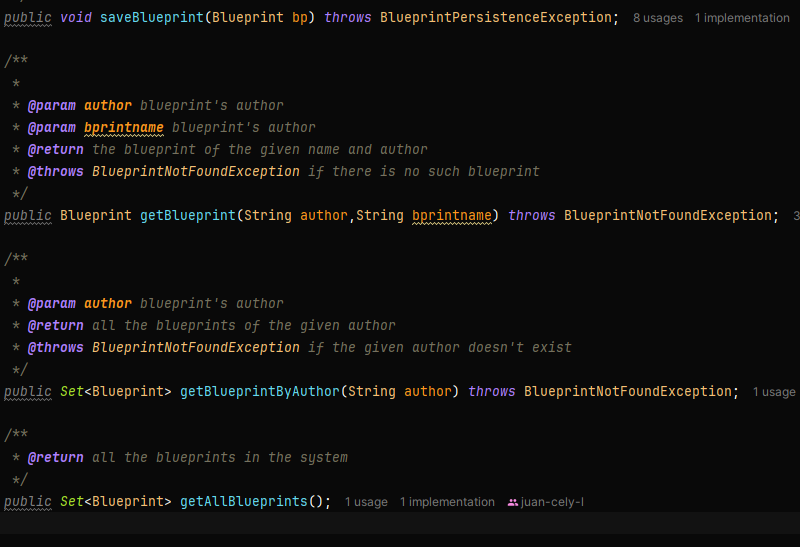
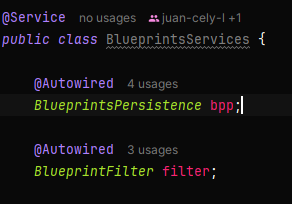
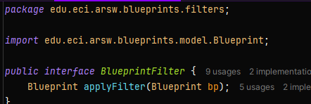

# Escuela Colombiana de Ingeniería
## Arquitecturas de Software

# Componentes y conectores - Parte I

El ejercicio se debe traer terminado para el siguiente laboratorio (Parte II).

### Middleware - gestión de planos

## Antes de hacer este ejercicio, realice [el ejercicio introductorio al manejo de Spring y la configuración basada en anotaciones](https://github.com/ARSW-ECI/Spring_LightweightCont_Annotation-DI_Example).

En este ejercicio se va a construír un modelo de clases para la capa lógica de una aplicación que permita gestionar planos arquitectónicos de una prestigiosa compañia de diseño.


1. Configure la aplicación para que funcione bajo un esquema de inyección de dependencias, tal como se muestra en el diagrama anterior.

   Lo anterior requiere:

    * Agregar las dependencias de Spring.
    * Agregar la configuración de Spring.
    * Configurar la aplicación -mediante anotaciones- para que el esquema de persistencia sea inyectado al momento de ser creado el bean 'BlueprintServices'.

   **Configuracion y dependencias**

```xml
<groupId>edu.eci.pdsw.examples</groupId>
<artifactId>blueprints-middleware</artifactId>
<version>0.0.1-SNAPSHOT</version>
<packaging>jar</packaging>

<name>Blueprints_Middleware</name>

<properties>
    <java.version>17</java.version>
    <spring-boot.version>2.7.18</spring-boot.version>
    <project.build.sourceEncoding>UTF-8</project.build.sourceEncoding>
    <project.reporting.outputEncoding>UTF-8</project.reporting.outputEncoding>
    <maven.compiler.source>17</maven.compiler.source>
    <maven.compiler.target>17</maven.compiler.target>
</properties>

<dependencies>
    <dependency>
        <groupId>org.springframework.boot</groupId>
        <artifactId>spring-boot-starter</artifactId>
        <version>${spring-boot.version}</version>
    </dependency>

    <dependency>
        <groupId>org.springframework.boot</groupId>
        <artifactId>spring-boot-starter-test</artifactId>
        <version>${spring-boot.version}</version>
        <scope>test</scope>
    </dependency>

    <dependency>
        <groupId>javax.inject</groupId>
        <artifactId>javax.inject</artifactId>
        <version>1</version>
    </dependency>
    <dependency>
        <groupId>junit</groupId>
        <artifactId>junit</artifactId>
        <version>4.12</version>
        <scope>test</scope>
    </dependency>
</dependencies>

<build>
    <plugins>
        <plugin>
            <groupId>org.springframework.boot</groupId>
            <artifactId>spring-boot-maven-plugin</artifactId>
            <version>${spring-boot.version}</version>
        </plugin>
        <plugin>
            <groupId>org.apache.maven.plugins</groupId>
            <artifactId>maven-compiler-plugin</artifactId>
            <version>3.11.0</version>
            <configuration>
                <release>17</release>
            </configuration>
        </plugin>
    </plugins>
</build>
</project>
```

**Se define BlueprintPersistence**





2. Complete los operaciones getBluePrint() y getBlueprintsByAuthor(). Implemente todo lo requerido de las capas inferiores (por ahora, el esquema de persistencia disponible 'InMemoryBlueprintPersistence') agregando las pruebas correspondientes en 'InMemoryPersistenceTest'.

**En el Servicio**


**En la Interfaz**


```java
/*
 * To change this license header, choose License Headers in Project Properties.
 * To change this template file, choose Tools | Templates
 * and open the template in the editor.
 */
package edu.eci.arsw.blueprints.test.persistence.impl;

import edu.eci.arsw.blueprints.model.Blueprint;
import edu.eci.arsw.blueprints.model.Point;
import edu.eci.arsw.blueprints.persistence.BlueprintNotFoundException;
import edu.eci.arsw.blueprints.persistence.BlueprintPersistenceException;
import edu.eci.arsw.blueprints.persistence.impl.InMemoryBlueprintPersistence;
import java.util.logging.Level;
import java.util.logging.Logger;
import org.junit.Test;
import static org.junit.Assert.*;
import static org.junit.jupiter.api.Assertions.fail;

/**
 *
 * @author hcadavid
 */
public class InMemoryPersistenceTest {

    @Test
    public void saveNewAndLoadTest() throws BlueprintPersistenceException, BlueprintNotFoundException{
        InMemoryBlueprintPersistence ibpp=new InMemoryBlueprintPersistence();

        Point[] pts0=new Point[]{new Point(40, 40),new Point(15, 15)};
        Blueprint bp0=new Blueprint("mack", "mypaint",pts0);
        
        ibpp.saveBlueprint(bp0);
        
        Point[] pts=new Point[]{new Point(0, 0),new Point(10, 10)};
        Blueprint bp=new Blueprint("john", "thepaint",pts);
        
        ibpp.saveBlueprint(bp);
        
        assertNotNull("Loading a previously stored blueprint returned null.",ibpp.getBlueprint(bp.getAuthor(), bp.getName()));
        
        assertEquals("Loading a previously stored blueprint returned a different blueprint.",ibpp.getBlueprint(bp.getAuthor(), bp.getName()), bp);
    }


    @Test
    public void saveExistingBpTest() {
        InMemoryBlueprintPersistence ibpp=new InMemoryBlueprintPersistence();
        
        Point[] pts=new Point[]{new Point(0, 0),new Point(10, 10)};
        Blueprint bp=new Blueprint("john", "thepaint",pts);
        
        try {
            ibpp.saveBlueprint(bp);
        } catch (BlueprintPersistenceException ex) {
            fail("Blueprint persistence failed inserting the first blueprint.");
        }
        
        Point[] pts2=new Point[]{new Point(10, 10),new Point(20, 20)};
        Blueprint bp2=new Blueprint("john", "thepaint",pts2);

        try{
            ibpp.saveBlueprint(bp2);
            fail("An exception was expected after saving a second blueprint with the same name and autor");
        }
        catch (BlueprintPersistenceException ex){
            
        }
    }
}
```

3. Haga un programa en el que cree (mediante Spring) una instancia de BlueprintServices, y rectifique la funcionalidad del mismo: registrar planos, consultar planos, registrar planos específicos, etc.

**Para ello se agrega La firma @Service a la clase BlueprintServices**



4. Se quiere que las operaciones de consulta de planos realicen un proceso de filtrado, antes de retornar los planos consultados. Dichos filtros lo que buscan es reducir el tamaño de los planos, removiendo datos redundantes o simplemente submuestrando, antes de retornarlos. Ajuste la aplicación (agregando las abstracciones e implementaciones que considere) para que a la clase BlueprintServices se le inyecte uno de dos posibles 'filtros' (o eventuales futuros filtros). No se contempla el uso de más de uno a la vez:

   **Para ello se crea la interfaz BlueprintFilter**

   

    * (A) Filtrado de redundancias: suprime del plano los puntos consecutivos que sean repetidos.

   **Para ello se crea la clase RedundancyFilter la cual implementa BlueprintFilter**

   ```java
   @Component
   public class RedundancyFilter implements BlueprintFilter {

       @Override
       public Blueprint applyFilter(Blueprint bp) {
           List<Point> points = bp.getPoints();
           List<Point> filteredPoints = new ArrayList<>();

           if (points.isEmpty()) {
               return bp;
           }

           filteredPoints.add(points.get(0));

           for (int i = 1; i < points.size(); i++) {
               Point current = points.get(i);
               Point previous = points.get(i - 1);

               if (current.getX() != previous.getX() || current.getY() != previous.getY()) {
                   filteredPoints.add(current);
               }
           }

           Blueprint filteredBp = new Blueprint(bp.getAuthor(), bp.getName());
           for (Point p : filteredPoints) {
               filteredBp.addPoint(p);
           }

           return filteredBp;
       }
   }
   ```

    * (B) Filtrado de submuestreo: suprime 1 de cada 2 puntos del plano, de manera intercalada.

   **Para ello se crea la clase SubsamplingFilter la cual implementa BlueprintFilter**

   ```java
   package edu.eci.arsw.blueprints.filters.impl;

   import edu.eci.arsw.blueprints.filters.BlueprintFilter;
   import edu.eci.arsw.blueprints.model.Blueprint;
   import edu.eci.arsw.blueprints.model.Point;
   import org.springframework.context.annotation.Primary;
   import org.springframework.stereotype.Component;

   import java.util.ArrayList;
   import java.util.List;

   @Component
   @Primary
   public class SubsamplingFilter implements BlueprintFilter {

       @Override
       public Blueprint applyFilter(Blueprint bp) {
           List<Point> points = bp.getPoints();
           List<Point> filteredPoints = new ArrayList<>();

           // Mantener solo los puntos con índice par
           for (int i = 0; i < points.size(); i++) {
               if (i % 2 == 0) {
                   filteredPoints.add(points.get(i));
               }
           }

           Blueprint filteredBp = new Blueprint(bp.getAuthor(), bp.getName());
           for (Point p : filteredPoints) {
               filteredBp.addPoint(p);
           }

           return filteredBp;
       }
   }
   ```

5. Agregue las pruebas correspondientes a cada uno de estos filtros, y pruebe su funcionamiento en el programa de prueba, comprobando que sólo cambiando la posición de las anotaciones -sin cambiar nada más-, el programa retorne los planos filtrados de la manera (A) o de la manera (B).

**Se creó la clase FilterTest**

```java
public class FilterTest {

    @Test
    public void redundancyFilterShouldRemoveConsecutiveRepeatedPoints() {
        // Arrange
        Point[] points = new Point[]{
            new Point(1, 1),
            new Point(1, 1),
            new Point(2, 2),
            new Point(3, 3),
            new Point(3, 3),
            new Point(4, 4)
        };
        Blueprint bp = new Blueprint("author", "test", points);
        RedundancyFilter filter = new RedundancyFilter();

        // Act
        Blueprint filteredBp = filter.applyFilter(bp);

        // Assert
        assertEquals(4, filteredBp.getPoints().size());
        assertEquals(1, filteredBp.getPoints().get(0).getX());
        assertEquals(2, filteredBp.getPoints().get(1).getX());
        assertEquals(3, filteredBp.getPoints().get(2).getX());
        assertEquals(4, filteredBp.getPoints().get(3).getX());
    }

    @Test
    public void subsamplingFilterShouldRemoveEveryOtherPoint() {
        // Arrange
        Point[] points = new Point[]{
            new Point(1, 1),
            new Point(2, 2),
            new Point(3, 3),
            new Point(5, 5)
        };
        Blueprint bp = new Blueprint("author", "test", points);
        SubsamplingFilter filter = new SubsamplingFilter();

        // Act
        Blueprint filteredBp = filter.applyFilter(bp);

        // Assert
        assertEquals(3, filteredBp.getPoints().size());
        assertEquals(1, filteredBp.getPoints().get(0).getX());
        assertEquals(3, filteredBp.getPoints().get(1).getX());
        assertEquals(5, filteredBp.getPoints().get(2).getX());
    }
}
```